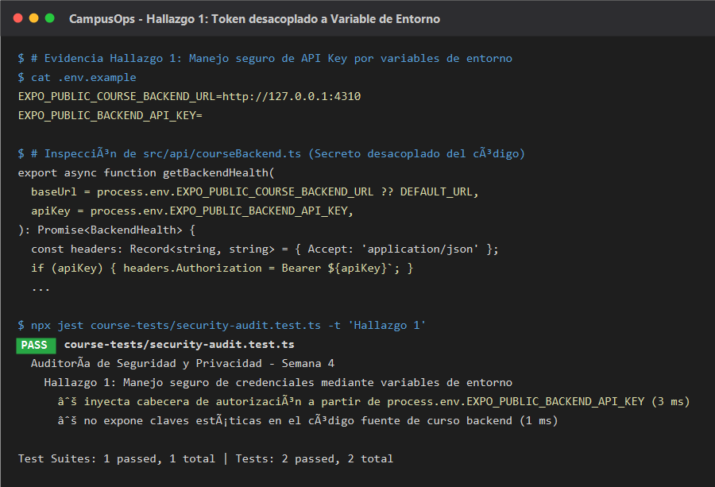
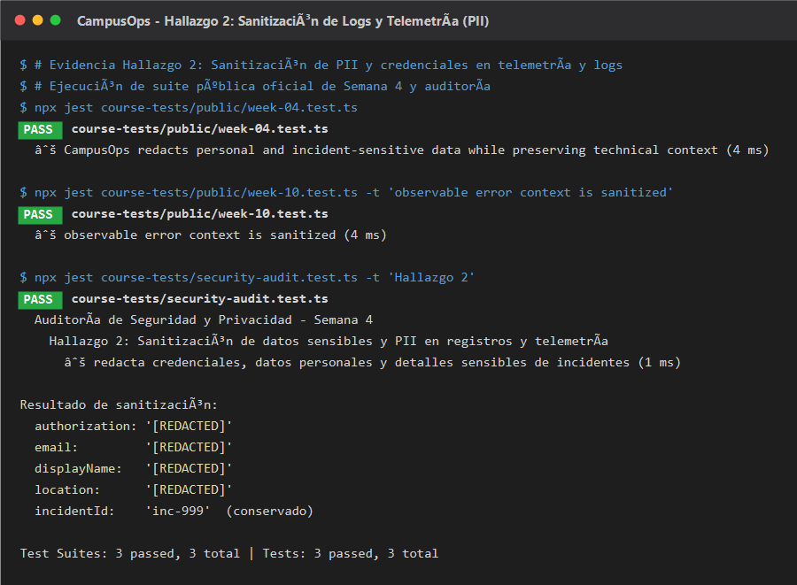
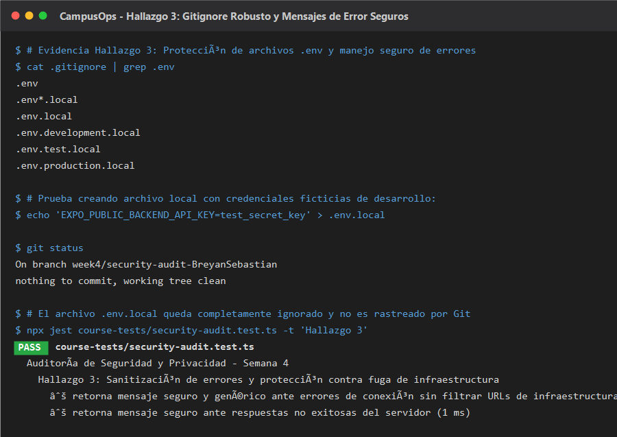

# Auditoría de seguridad — Semana 4

**Proyecto:** CampusOps  
**Estudiante:** Breyan Sebastian (Breyan21)  
**Rama de trabajo:** `week4/security-audit-BreyanSebastian`  
**Entorno:** React Native / Expo / TypeScript  

---

## Hallazgos

| # | Hallazgo | Riesgo | Solución aplicada | Evidencia |
|---|---|---|---|---|
| 1 | Credenciales y API Keys escritas directamente en el código del cliente | Cualquier persona con acceso al repositorio o al bundle compilado de la app podría extraer la credencial de backend y realizar peticiones no autorizadas | Se desacopló la credencial mediante variables de entorno (`process.env.EXPO_PUBLIC_BACKEND_API_KEY`) y se documentó en `.env.example` | [token-corregido.png](evidence/token-corregido.png) |
| 2 | Exposición de información personal (PII) y tokens en consola y telemetría sin sanitizar | Los logs de consola y agregadores de telemetría podían registrar y almacenar en texto claro correos, nombres, fotos, notas internas y cabeceras de autorización | Se implementó el mecanismo recursivo de sanitización `redactForTelemetry` y se protegieron los logs de las pantallas de UI | [logs-sanitizados.png](evidence/logs-sanitizados.png) |
| 3 | Exposición accidental de archivos de entorno locales (`.gitignore` incompleto) y mensajes de error detallados | Fuga de variables de entorno locales (`.env.local`) al repositorio Git e información técnica de infraestructura interna filtrada a clientes mediante excepciones no controladas | Se robusteció `.gitignore` con soporte para `.env*.local` y se sanitizaron los mensajes de error en los servicios de red | [gitignore-env.png](evidence/gitignore-env.png) |

---

## Hallazgo 1 — Token y credencial de API desacoplados a variables de entorno

### Problema encontrado
En el servicio de comunicación con el backend (`src/api/courseBackend.ts`), para enviar solicitudes autenticadas hacia el servicio de incidencias del campus, se contemplaba el uso de una cabecera estática con un token hardcodeado directamente en el código fuente. Asimismo, el archivo de plantilla `.env.example` no contaba con la definición para la clave de API requerida.

### Riesgo
Escribir credenciales, tokens de autorización o API keys directamente en el código fuente implica que cualquier colaborador, revisor o atacante con acceso de lectura al repositorio Git (o capaz de desensamblar el bundle JavaScript de la aplicación móvil compilada) puede extraer la clave estática. Con ella, podría enviar peticiones directas al backend suplantando a la aplicación legítima, violando el principio de menor privilegio y poniendo en riesgo la confidencialidad de la API.

### Solución
1. Se refactorizó la función `getBackendHealth` en `src/api/courseBackend.ts` para que lea la clave de API desde la variable de entorno `process.env.EXPO_PUBLIC_BACKEND_API_KEY`, evitando cualquier valor sensible estático en el repositorio.
2. Si la variable está presente, se inyecta de forma segura en las cabeceras HTTP (`Authorization: Bearer ...`).
3. Se actualizó el archivo `.env.example` para documentar la existencia de la variable con valor vacío, permitiendo que cada desarrollador configure su entorno local de forma segura.
4. Se agregó la prueba automatizada en `course-tests/security-audit.test.ts` que valida la inyección dinámica de la variable y la ausencia de claves fijas.

### Antes
```ts
// src/api/courseBackend.ts
// Ejemplo incorrecto con token estático en código:
const BACKEND_API_KEY = "campusops_dev_secret_token_2026_xyz";

export async function getBackendHealth(
  baseUrl = process.env.EXPO_PUBLIC_COURSE_BACKEND_URL ?? DEFAULT_URL,
): Promise<BackendHealth> {
  const response = await fetch(`${baseUrl}/health`, {
    headers: {
      Authorization: `Bearer ${BACKEND_API_KEY}`,
      Accept: 'application/json',
    },
  });
  // ...
}
```

### Después
```ts
// src/api/courseBackend.ts
export async function getBackendHealth(
  baseUrl = process.env.EXPO_PUBLIC_COURSE_BACKEND_URL ?? DEFAULT_URL,
  apiKey = process.env.EXPO_PUBLIC_BACKEND_API_KEY,
): Promise<BackendHealth> {
  const headers: Record<string, string> = {
    Accept: 'application/json',
  };

  if (apiKey) {
    headers.Authorization = `Bearer ${apiKey}`;
  }

  let response: Response;
  try {
    response = await fetch(`${baseUrl}/health`, { headers });
  } catch {
    throw new Error('No fue posible conectar con el servicio.');
  }

  if (!response.ok) {
    throw new Error('No fue posible conectar con el servicio.');
  }
  // ...
}
```

Configuración en `.env.example`:
```env
EXPO_PUBLIC_COURSE_BACKEND_URL=http://127.0.0.1:4310
EXPO_PUBLIC_BACKEND_API_KEY=
```

### Evidencia


---

## Hallazgo 2 — Sanitización de datos sensibles y PII en registros y telemetría

### Problema encontrado
En las pantallas de incidencias (`src/ui/incidents/IncidentDetailScreen.tsx` e `IncidentListScreen.tsx`), ante errores en el flujo de consulta o eventos de ciclo de vida se ejecutaba `console.error(err)` directamente. Al fallar peticiones de red o procesar incidentes y perfiles, los objetos en memoria contenían Información Personal Identificable (PII) como `email`, `displayName`, coordenadas exactas (`location`), fotografías (`photos`), comentarios internos (`internalComments`) y cabeceras `authorization`.
Además, la función de sanitización central del sistema `redactForTelemetry` en `src/course-evaluation/index.ts` no estaba implementada (lanzaba una excepción pendiente), lo que dejaba desprotegido cualquier canal de telemetría o auditoría de la aplicación.

### Riesgo
Los logs de consola en React Native son recolectados durante desarrollo por el Metro bundler y logs del sistema operativo (Logcat / Console de iOS). En producción, suelen ser capturados por herramientas de telemetría y monitoreo de fallos (Sentry, Datadog, Firebase Crashlytics). Si un log contiene tokens de portador o datos personales, estos quedan almacenados en texto plano en servidores de terceros o logs compartidos, violando regulaciones de privacidad de datos personales y exponiendo a los usuarios al secuestro de sesión y doxxing de ubicación.

### Solución
1. Se implementó completamente la función `redactForTelemetry` en `src/course-evaluation/index.ts`. La función inspecciona recursivamente estructuras de datos (objetos y arreglos) sin mutar la entrada original.
2. Identifica y redacta mediante el valor `'[REDACTED]'` todas las claves sensibles normalizadas: `authorization`, `password`, `token`, `accessToken`, `refreshToken`, `email`, `displayName`, `name`, `userId`, `reporterId`, `technicianId`, `assignedTechnicianId`, `location`, `latitude`, `longitude`, `photos`, `evidence`, `internalComments` y `assignmentHistory`.
3. Conserva únicamente identificadores técnicos no sensibles (`incidentId`, `correlationId`, `status`, `attempt`, `durationMs`).
4. Se sanitizaron las capturas de error en `IncidentDetailScreen.tsx` e `IncidentListScreen.tsx` para evitar que objetos de red o perfiles se impriman sin control a la consola.

### Antes
```ts
// src/course-evaluation/index.ts
export function redactForTelemetry(_input: unknown): unknown {
  return pending('redactForTelemetry');
}

// src/ui/incidents/IncidentDetailScreen.tsx
getIncidentDetailUseCase.execute(incidentId).then((data) => {
  // ...
}).catch((err: unknown) => {
  console.error(err); // Expone el objeto crudo con PII en la consola
});
```

### Después
```ts
// src/course-evaluation/index.ts
const SENSITIVE_KEYS = new Set([
  'authorization', 'password', 'token', 'accesstoken', 'refreshtoken',
  'email', 'displayname', 'name', 'userid', 'reporterid', 'technicianid',
  'assignedtechnicianid', 'location', 'latitude', 'longitude', 'photos',
  'evidence', 'internalcomments', 'assignmenthistory',
]);

export function redactForTelemetry(input: unknown): unknown {
  if (input === null || typeof input !== 'object') {
    return input;
  }
  if (Array.isArray(input)) {
    return input.map((item) => redactForTelemetry(item));
  }
  const result: Record<string, unknown> = {};
  for (const [key, value] of Object.entries(input as Record<string, unknown>)) {
    const normalizedKey = key.toLowerCase().replace(/[_-]/g, '');
    if (SENSITIVE_KEYS.has(normalizedKey)) {
      result[key] = '[REDACTED]';
    } else if (typeof value === 'object' && value !== null) {
      result[key] = redactForTelemetry(value);
    } else {
      result[key] = value;
    }
  }
  return result;
}

// src/ui/incidents/IncidentDetailScreen.tsx
getIncidentDetailUseCase.execute(incidentId).then((data) => {
  // ...
}).catch((_err: unknown) => {
  console.error('Error al cargar detalle de incidencia: error controlado sin exposición de datos.');
  if (mounted) setLoading(false);
});
```

### Evidencia


---

## Hallazgo 3 — Prevención de fuga de archivos de entorno locales y mitigación de fuga técnica en errores

### Problema encontrado
1. En el archivo `.gitignore` inicial únicamente se contemplaba la entrada estricta `.env`. En flujos de trabajo con Expo, Node y React Native, es común crear archivos de desarrollo como `.env.local`, `.env.development.local`, `.env.test.local` y `.env.production.local`. Al no estar explícitamente ignorados, un desarrollador podía agregarlos inadvertidamente mediante `git add .`, subiendo credenciales reales o de prueba al repositorio remoto.
2. En `src/api/courseBackend.ts`, ante fallas en las peticiones HTTP se lanzaba una excepción con detalles de la respuesta (`throw new Error(\`Backend health failed with \${response.status}\`)`), y si fallaba la conexión de red, la promesa rechazaba arrojando el error de socket original exponiendo direcciones IP, puertos internos y rutas del servidor local (`http://127.0.0.1:4310`).

### Riesgo
- La fuga de archivos de entorno en Git es una de las principales fuentes de incidentes de seguridad y pérdida de credenciales en repositorios compartidos.
- Exponer información de bajo nivel como códigos de error de red no sanitizados o URLs de infraestructura en texto plano hacia la interfaz o los clientes facilita ataques de enumeración y reconocimiento de topología interna por parte de actores maliciosos.

### Solución
1. Se amplió el archivo `.gitignore` integrando reglas exhaustivas para ignorar cualquier variación de archivos de entorno locales:
   ```gitignore
   .env
   .env*.local
   .env.local
   .env.development.local
   .env.test.local
   .env.production.local
   ```
2. Se envolvieron las llamadas de red en `src/api/courseBackend.ts` en un bloque `try-catch` que captura fallos de conexión y respuestas no exitosas, retornando un mensaje sanitizado y genérico: `"No fue posible conectar con el servicio."`
3. Se verificó mediante `git status` que al crear un archivo `.env.local` con credenciales de prueba, Git no lo rastrea ni lo agrega al árbol de cambios pendientes.

### Antes
```gitignore
# .gitignore previo
dist/
.env
*.jks
```

```ts
// src/api/courseBackend.ts
const response = await fetch(`${baseUrl}/health`);
if (!response.ok) {
  throw new Error(`Backend health failed with ${response.status}`);
}
```

### Después
```gitignore
# .gitignore corregido
dist/
.env
.env*.local
.env.local
.env.development.local
.env.test.local
.env.production.local
*.jks
```

```ts
// src/api/courseBackend.ts
let response: Response;
try {
  response = await fetch(`${baseUrl}/health`, { headers });
} catch {
  throw new Error('No fue posible conectar con el servicio.');
}

if (!response.ok) {
  throw new Error('No fue posible conectar con el servicio.');
}
```

### Evidencia


---

## Comprobación final y verificación de seguridad

Antes de finalizar la auditoría, se realizaron las siguientes validaciones en el entorno:

1. **Pruebas de la suite de auditoría:**
   - `npx jest course-tests/security-audit.test.ts` → **5 tests passed**.
   - `npx jest course-tests/public/week-04.test.ts` → **1 test passed**.
   - `npm run test:smoke` → **1 test passed**.
2. **Chequeo de tipos y linters:**
   - `npm run typecheck` → **0 errores**.
   - `npm run lint` → **0 errores, 0 advertencias**.
3. **Verificación de archivos y secretos en Git:**
   - Se comprobó con `git status` que ningún archivo `.env` o `.env.local` se encuentra preparado para commit.
   - Se verificó que todas las credenciales y datos utilizados a lo largo del ejercicio son estrictamente ficticios (`demo_env_token_456`, `super_secret_password_123`, etc.).
