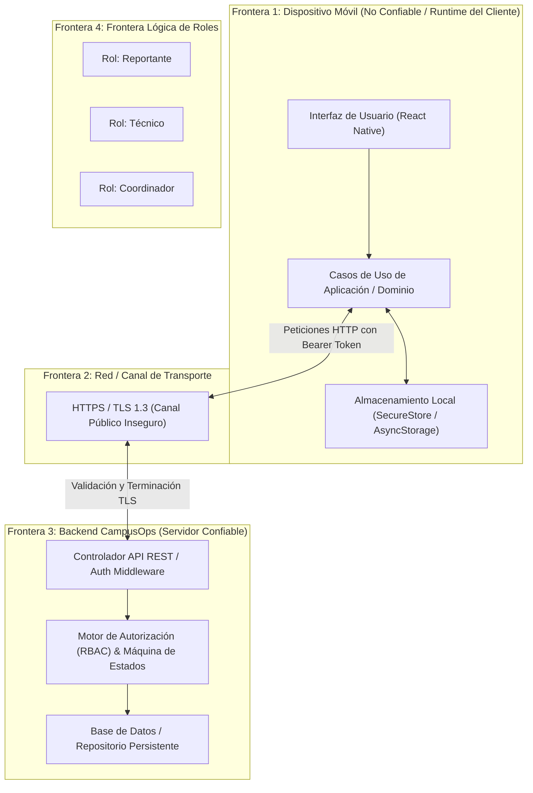

# Modelo de Amenazas — CampusOps (Semana 3)

## 1. Introducción y Alcance

CampusOps es una aplicación móvil desarrollada en React Native con Expo y TypeScript orientada a la gestión de incidencias dentro de un campus universitario ficticio. El sistema permite reportar fallas de infraestructura, clasificarlas, asignar personal técnico, dar seguimiento al ciclo de vida de atención y cerrarlas formalmente.

Dado que la aplicación gestiona información sensible —incluyendo sesiones de usuario, evidencias fotográficas, geolocalización de incidentes y asignaciones operativas—, este modelo de amenazas formaliza la postura de seguridad del proyecto. Define los **activos** a proteger, delimita las **fronteras de confianza**, identifica y prioriza las **amenazas** potenciales bajo la metodología STRIDE, y establece los **controles** técnicos y mecanismos de **verificación** que mitigan cada riesgo.

---

## 2. Activos a Proteger

Un **activo** en CampusOps es cualquier dato, componente o recurso que posee valor operativo o confidencial y cuya pérdida de confidencialidad, integridad o disponibilidad generaría un impacto negativo en el sistema.

| Identificador | Activo | Descripción y Nivel de Sensibilidad | Impacto de Compromiso |
|---|---|---|---|
| **AST-01** | **Sesiones y Tokens de Autenticación** | Tokens JWT/Bearer de sesión emitidos para Reportantes, Técnicos y Coordinadores. | **Crítico**: Suplantación de identidad (Spoofing) y acceso a funciones privilegiadas. |
| **AST-02** | **Asignaciones y Estados de Incidencias** | Integridad del ciclo de vida (`open` → `assigned` → `in_progress` → `resolved` → `closed`) y la relación de técnico asignado (`assignedTechnicianId`). | **Crítico**: Alteración indebida de flujo de trabajo, cierre fraudulento de fallas y sabotaje a la asignación de recursos. |
| **AST-03** | **Fotografías y Evidencias Multimedia** | Imágenes adjuntas por reportantes o técnicos que documentan el daño o la resolución de la incidencia. | **Alto**: Violación de privacidad, alteración de evidencia o inyección de archivos no permitidos. |
| **AST-04** | **Datos de Ubicación y Georreferencias** | Coordenadas GPS del dispositivo, mapas y referencias descriptivas de edificios/aulas. | **Medio / Alto**: Exposición de patrones de desplazamiento o geolocalización no autorizada. |
| **AST-05** | **Registros de Auditoría y Trazabilidad (Logs)** | Bitácora de eventos del sistema, trazas de depuración y solicitudes HTTP. | **Medio**: Exposición accidental de información sensible (PII/tokens) en artefactos o consolas. |

---

## 3. Fronteras de Confianza (Trust Boundaries)

Las fronteras de confianza definen las líneas perimetrales donde los datos cruzan entre componentes que operan con diferentes niveles de privilegio o confianza.

### Detalle de las Fronteras de Confianza:

1. **TB-01: Dispositivo Móvil vs. Canal de Red:**
   - Todo dato que sale del cliente móvil hacia el exterior viaja a través de redes WiFi públicas o celulares. No se puede garantizar la seguridad del canal sin cifrado estricto (TLS).
2. **TB-02: Cliente Móvil vs. API Backend:**
   - La API del backend **nunca debe confiar** en las aserciones enviadas ciegamente por la interfaz de usuario. Ocultar un botón o vista en la UI no constituye un control de seguridad. Toda petición que intente alterar estados o consultar registros debe validar credenciales y permisos en el servidor.
3. **TB-03: Aplicación vs. Almacenamiento Local:**
   - El almacenamiento local en el dispositivo físico puede ser extraído si el dispositivo está rooteado o si se inspecciona una copia de seguridad. Los tokens deben residir en almacenamiento seguro (`SecureStore` con Keystore/Keychain), mientras que la base de datos offline no debe contener credenciales en texto claro.
4. **TB-04: Frontera de Roles (Reportante, Técnico, Coordinador):**
   - Cada perfil de usuario posee un conjunto restringido de capacidades operativas. Las transiciones de estado de una incidencia deben ser validadas según el rol del actor autenticado.

---

## 4. Identificación y Análisis de Amenazas (STRIDE)

Se aplica la metodología **STRIDE** para categorizar los vectores de ataque sobre los activos y componentes de CampusOps:

### TH-01: Alteración no autorizada de estados y asignaciones (Tampering / Elevation of Privilege)
- **Actores involucrados:** Usuario malicioso con rol de `Reportante` o `Técnico` no asignado.
- **Descripción de la amenaza:** Un actor malicioso intercepta o manipula una petición HTTP (o manipula el estado de la aplicación) para forzar un cambio de estado prohibido; por ejemplo, un **reportante que intenta cerrar (`closed`) su propia incidencia** para fingir que fue atendida, o un técnico que intenta modificar o marcar como resuelta (`resolved`) una incidencia asignada a otro técnico.
- **Impacto:** Crítico. Degrada totalmente la integridad operativa del campus, falsea indicadores y permite a usuarios no autorizados eludir los procesos de supervisión institucional.
- **Probabilidad:** Alta (fácilmente explotable si solo se ocultan botones en la UI).

### TH-02: Acceso indebido a reportes ajenos y evidencias sensibles (Information Disclosure / BOLA)
- **Actores involucrados:** Reportante curioso o actor externo autenticado.
- **Descripción de la amenaza:** Un usuario autenticado modifica el `incidentId` en las peticiones GET para visualizar detalles de reportes de terceros, fotografías adjuntas de instalaciones privadas o notas internas de diagnóstico.
- **Impacto:** Alto. Violación de confidencialidad y posible filtración de datos de ubicación o imágenes de zonas restringidas.
- **Probabilidad:** Alta (común en APIs REST con identificadores secuenciales o sin validación de pertenencia).

### TH-03: Suplantación de identidad por secuestro de tokens de sesión (Spoofing)
- **Actores involucrados:** Atacante local con acceso físico o lógico al dispositivo.
- **Descripción de la amenaza:** Extracción de tokens de autenticación almacenados en texto plano dentro de `AsyncStorage` o compartidos en cachés no protegidas, permitiendo clonar la sesión activa del técnico o coordinador.
- **Impacto:** Alto. Acceso administrativo y control total de incidencias.
- **Probabilidad:** Media.

### TH-04: Fuga de información confidencial en logs y artefactos de CI/CD (Information Disclosure)
- **Actores involucrados:** Desarrollador, pipeline de integración continua o atacante con acceso a reportes de CI.
- **Descripción de la amenaza:** Impresión de tokens de acceso, credenciales de prueba, contraseñas o datos personales (PII) en los registros de consola (`console.log`) o almacenamiento de secretos dentro del repositorio Git.
- **Impacto:** Alto. Exposición de credenciales de infraestructura o servicios.
- **Probabilidad:** Media.

### TH-05: Modificación fraudulenta en sincronización offline (Tampering / Repudiation)
- **Actores involucrados:** Técnico trabajando sin conexión.
- **Descripción de la amenaza:** Un técnico almacena cambios en la cola local sin conexión, y antes de sincronizar, altera maliciosamente la marca temporal o la clave de idempotencia para sobrescribir una reasignación realizada previamente por el coordinador.
- **Impacto:** Medio. Conflictos de datos no resueltos y pérdida de auditoría en la asignación.
- **Probabilidad:** Baja / Media.

---

## 5. Priorización de Riesgos

La priorización se determina combinando la severidad del impacto y la probabilidad de explotación:

| Prioridad | ID Amenaza | Amenaza | Severidad | Justificación de la Prioridad |
|---|---|---|---|---|
| **1 (Crítica)** | **TH-01** | **Alteración no autorizada de estados y asignaciones** | **Crítica** | Atenta directamente contra la regla de negocio central de CampusOps. Si un reportante puede cerrar una incidencia o un técnico puede usurpar asignaciones ajenas, el sistema pierde toda validez operativa. Debe atenderse primero mediante controles en el backend y dominio. |
| **2 (Alta)** | **TH-02** | **Acceso indebido a reportes ajenos (BOLA / IDOR)** | **Alta** | Compromete la privacidad de los reportantes y la confidencialidad de las fotos y ubicaciones de la universidad. |
| **3 (Alta)** | **TH-03** | **Secuestro de sesión y almacenamiento inseguro** | **Alta** | Permite eludir todos los controles de perfil suplantando a coordinadores o técnicos legítimos. |
| **4 (Media)** | **TH-04** | **Fuga de secretos o PII en logs y CI** | **Media** | Prevenible mediante herramientas automáticas de escaneo en el pipeline de integración continua. |
| **5 (Media)** | **TH-05** | **Manipulación de sincronización y resolución de conflictos** | **Media** | Relevante para fases offline posteriores (Semana 8), requiere políticas de idempotencia. |

---

## 6. Matriz de Trazabilidad: Activo, Amenaza, Control y Verificación

Para garantizar que el modelo no sea un ejercicio puramente teórico, cada riesgo identificado se vincula de manera directa con un **activo**, una **amenaza**, un **control** de mitigación formal y un método de **verificación** reproducible:

| Activo | Amenaza | Nivel de Riesgo | Control Técnico | Verificación Asociada |
|---|---|---|---|---|
| **AST-02** (Asignaciones y Estados) | **TH-01**: Alteración de estado por actor no autorizado (ej. reporter intenta cerrar) | **Crítica** | **Control RBAC y Máquina de Estados en Dominio/Backend:** Validación obligatoria en controladores y casos de uso. Solo el rol `Coordinador` puede transicionar a `closed` o modificar `assignedTechnicianId`. Solo el `Técnico` titular asignado puede transicionar a `in_progress` o `resolved`. El `Reportante` no puede alterar estados una vez creada la incidencia. | **Prueba negativa de autorización:** Ejecución de suites de prueba unitarias e integración que verifiquen rechazo con HTTP 403 / `ForbiddenError` ante transiciones de estado inválidas por rol (`course-tests/public/week-03.test.ts` y pruebas de dominio). |
| **AST-03** y **AST-04** (Fotos y Ubicaciones) | **TH-02**: Acceso no autorizado a reportes ajenos (IDOR/BOLA) | **Alta** | **Control de Autorización a Nivel de Objeto (BOLA Prevention):** Validación en capa de consulta de incidencias verificando que el usuario solicitante sea el autor del reporte, el técnico asignado o un coordinador con permiso global. | **Prueba de límites en API:** Verificación con casos de prueba donde un ID de usuario diferente recibe error de autorización al intentar consultar un `incidentId` ajeno. |
| **AST-01** (Sesiones) | **TH-03**: Secuestro y robo de tokens de sesión | **Alta** | **Almacenamiento Cifrado en Hardware:** Empleo exclusivo de `expo-secure-store` respaldado por Android Keystore / iOS Keychain para tokens JWT. Expiración de tokens y revocación en logout. | **Inspección de código y pruebas:** Auditoría de dependencias (`npm run audit:ci`) y verificación de que ningún token se persista en `AsyncStorage` ordinario. |
| **AST-05** (Logs y Auditoría) | **TH-04**: Fuga de secretos y credenciales en código o CI | **Media** | **Filtro de Secretos y Sanitización de Trazas:** Ejecución automatizada de detectores de credenciales en GitHub Actions (`SECRET_PATTERNS` en `tools/course_public_evaluator.py`) y prohibición de imprimir tokens o PII en logs de consola. | **Comprobación en CI:** Paso `Secret scan` en el workflow `.github/workflows/week-03-ci-amenazas-feedback.yml` y comando `make verify-week-03`. |
| **AST-02** (Asignaciones) | **TH-05**: Manipulación de cola offline y reasignaciones | **Media** | **Control de Idempotencia y Versionado de Estado:** Cada operación sin conexión incluye clave de idempotencia (`idempotencyKey`) y versión base de la entidad (`baseVersion`). Si el estado remoto fue reasignado, se declara conflicto en lugar de sobrescribir. | **Prueba de simulación de conflicto:** Pruebas automatizadas de concurrencia y verificación de la tupla `{ assignedTechnicianId, status }` (Hito 8). |

---

## 7. Justificación de la Arquitectura de Seguridad

La decisión central de seguridad de CampusOps radica en **rechazar la seguridad por oscuridad basada en la interfaz gráfica**. La aplicación móvil implementa una arquitectura por capas (definida en el ADR-001):

1. **La UI solo refleja capacidades:** La UI puede ocultar o deshabilitar opciones para mejorar la experiencia de usuario, pero jamás se considera una barrera de seguridad.
2. **El dominio valida invariantes de negocio:** Cada caso de uso (`ChangeIncidentStatus`, `AssignTechnician`, `CloseIncident`) encapsula reglas de autorización basadas en roles.
3. **El backend es la autoridad final:** Toda llamada de red es verificada contra el token de sesión y la matriz de permisos RBAC institucional.
